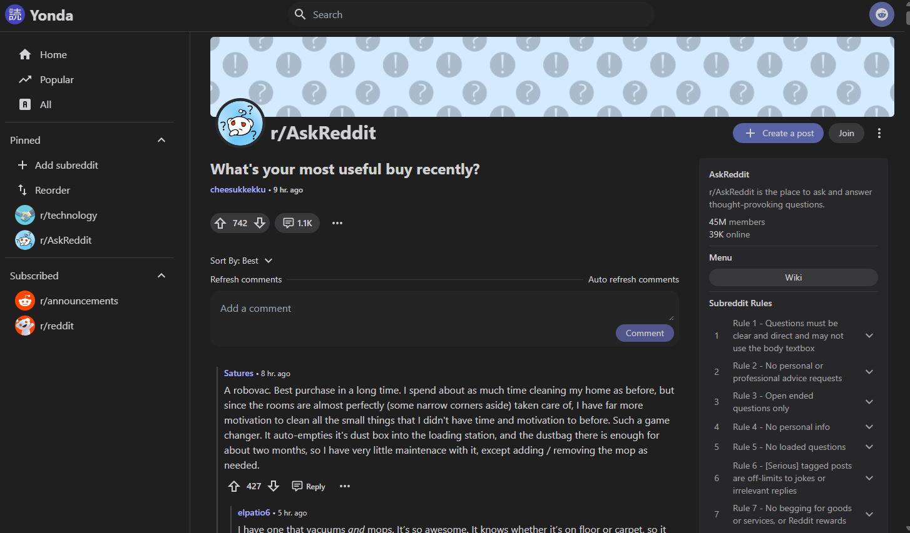

#  Yonda for Reddit

Yonda is a web Reddit client built with SvelteKit.

## Features

- Log in with Reddit Oauth to access your subscribed subreddits and post and comment with your account
- Pin subreddits for quick access and reorder them to your liking
- Refresh the comments in a post or automatically refresh the comments after a certain amount of time has past
- Browse Reddit faster (97 vs 67 in performance for Desktop on PageSpeed Insights when loading /r/AskReddit)
- Pan and zoom images
- Navigate back to posts and comments fast with caching
- Switch between posts view types (classic and card)
- Display the number of new comments for a post since the last visit

